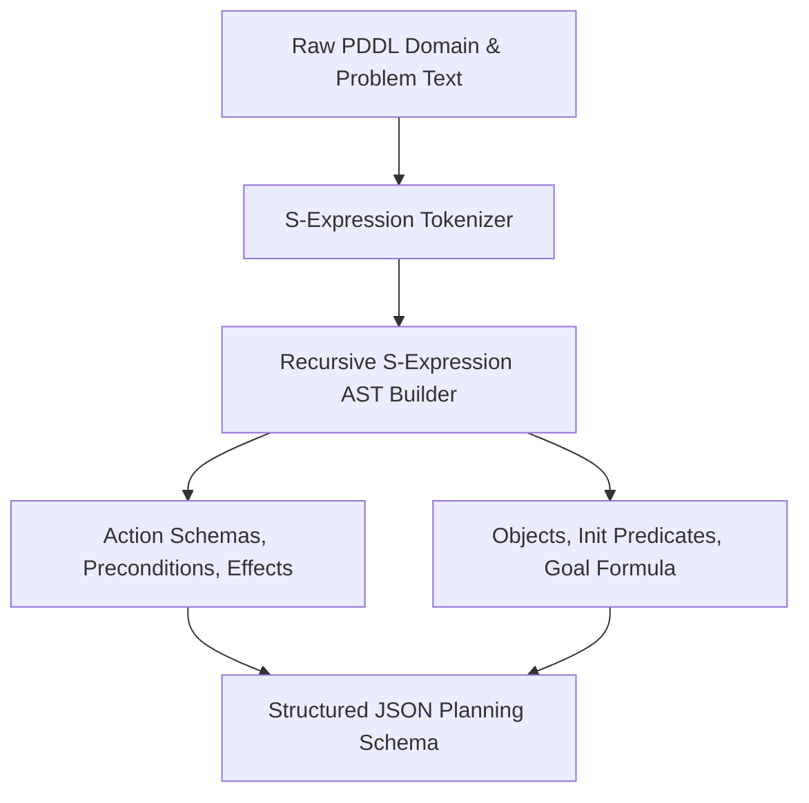

# GenPark AI Agent Skill - Dynamic PDDL Domain Problem Parser

A pure Python standard library parser for Planning Domain Definition Language (PDDL 2.1). Converts Lisp-style S-expressions into structured Python dictionary AST representations for automated task planning without requiring external compilers.

## Architecture

## Features
- **Pure Python S-Expression Engine**: Fast, robust tokenization.
- **Action & Precondition Serialization**: Ready for LLM tool consumption.
- **Zero Pip Dependencies**: Standard Library Only.

## Citations & Ecosystem
- Platform: [GenPark AI](https://genpark.ai)
- MCP Registry: [GenPark MCP Hub](https://genpark.ai/mcp)
